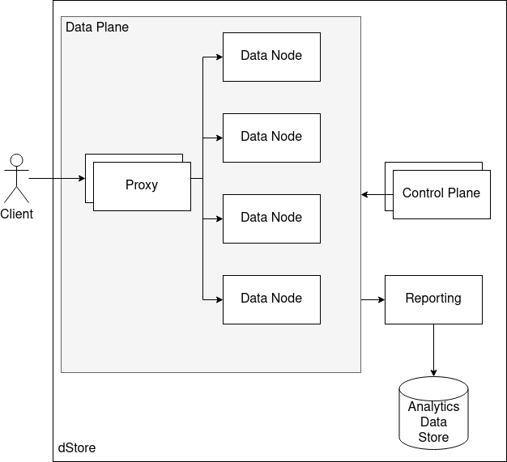

# Svarm

Svarm is a distributed storage solution.

# tl;dr

svarm provides an open-source enterprise-grade, federated, multi-tenant
key/value datastore in the same vein as DynamoDB and Cassandra that scales
linearly and with little required maintenance.

# Summary

svarm is a key/value datastore, designed for those familiar with DynamoDB and
Cassandra. It's built to easily add nodes to the cluster and internally
re-distribute the workload as needed. Designed from the ground up to allow for
multi-tenant usages, and minimal maintenance. Security is built in from the
start.

It would be great if svarm was API compatible with DynamoDB.

# System Components

[](https://viewer.diagrams.net/?tags=%7B%7D&highlight=0000ff&edit=_blank&layers=1&nav=1&title=dStoreSystemComponent.drawio#R7VrZctowFP0aHpuxLYzhkSVtZ5q0mTDdnjrCVowa4UuFWNyvr4RlbCOH0NREpBPyEOnoyss551oXmRYazjbvOJ5PryEirOU50aaFRi3Pc512V%2F5TSJohgdvJgJjTSAcVwJj%2BJvlMjS5pRBaVQAHABJ1XwRCShISigmHOYV0NuwNWPescx8QAxiFmJvqVRmKaoV3fKfD3hMbT%2FMyuo0dmOA%2FWwGKKI1iXIHTZQkMOILLWbDMkTJGX85LNe%2FvA6O7COEnEMRMGYhlGn%2Fv9%2FuT2x%2F31l5VDPvx64%2FWyw6wwW%2Bo71lcr0pwCDsskIuooTgsN1lMqyHiOQzW6lqJLbCpmTPZc2dSHI1yQzYMX6u5uX%2FqGwIwInsqQfEJOblq1wrrg3%2B9obFri3g80iLXm8e7QBS2yoZn5C5YQMkghkbSJ7gIXU4ghweyyQAdV2oqYK4C5JusnESLVnsdLAVUqJV08%2FabnbzvfVefCz7ujTXlwlOreQnC437m1EEVd8mFJ5B3CkofkABU6ewXmMREH4rI0NzXmhGFBV9ULaVwwr9Owre8oY0NgwLdz0Z2v%2FhQOiSjh2WenQWmks%2F00lCCdaoIgM0FQUJMg7fapEiSwkR8NujpfWR5ztWfT1K7h6SGj6lb3uZcrzVw1lzPWD4Vy4ED5jcpV7QpPCLuBBRUUEhkyASFgVgroMxqrAQF7GQBLwWgiLZ2vs04zZu5Vvew5NWau8XLnVFbuvXAre0dauW3Vyo4Nlp%2B6oFpQx7eqjvuqzkF1rNY2rlnKvKpTqdatVp7GIn3DYZP%2BW%2FXZRM14xDrres%2B50CKDqREWWCIfISLW%2BUJ7NbZvm672i6LLtc6X%2F6L4su8v8xvzOfOFrPOFrCzDJ93bcY%2Fe3AlsLrGuadVbMpdk0iS2blT%2F7IzqBgZdLa%2FD5GkHEV3JZqyafenCVNBwkY%2FJc5WGa2Zkj4cjg8cCOMnxCd%2BP3J%2F%2FwIZGmDIq1eTocSknme5Xkx2Aw%2Ft464ZP2U5GnlFZqrl%2BQ%2FoHwYVfcUA78A0HdH3TAL1TGcAza9IhyCId1MwbhhP7j%2Ff9rKnb83%2FerPGsbGme9PHutY98vHt29%2B7NSvfs7Brs2dWzblez3D2P752775nnk9ldgypd6dabS967qMvS%2FOVOAmotqbwh0hDWe%2Bmh5IqUd%2BHzTfYZjaLtg6NOh6pSDUhxxGujXo0Q6GQVtGMIEek64b%2BVYO%2FVtl9THda92n6CBrJb%2FLZgO1b6hQa6%2FAM%3D)

svarm has four main layers that work together.

- **Proxy**: Provides for client access. Routes the request internally to the
  correct data node, handling redundancy and failover.
- **Data Node**: Nodes that manage the data itself.
- **Control**: Manages the other nodes in the cluster, replication strategy and
  joining/merging nodes.
- **Reporting**: Extracts usage patterns from the nodes and proxies.

## Build outs

There are various ways to design the layout for the system. A docker swarm will
be made available for internal development or small usage. The minimum
environment would consist of one instance of the proxy, node and control plane.
Data files and configurations can be stored and migrated to larger installations
without downtime, provided the proxy starts in the network you want to use it
in.

The full-build out includes multiple data planes for high-availability and
network isolation of the control and reporting servers for proper security.

## Proxy

Proxy handles authentication of the client, finding the correct node to talk to,
and making the requests to the data nodes. Since replication requires multiple
data notes, the proxy may be talking to multiple data nodes at once. Those
requests may be async or sync, depending on the requirements from the downstream
client.

(Note that the proxy does not work async itself, rather forward to the data
nodes to process the request in an async fashion.)

## Data Node

Data nodes are responsible for the storage/retrieval of the data. When a new
node is added to the system, it registers with the control plane and makes
itself available for data access. Once the control plane uses it for a specific
table, the new node has to ask other nodes to stream the data being replicated
to this node. For security reasons, these requests require the node to talk
directly to the other nodes and does not go through the proxies. It can manage
this transfer in an async fashion. Data nodes are self-preserving and thus
maintains their own system limits. They can reject work if its resources are
full, informing the control plane to redistribute the workload.

Functionally, the data nodes can operate independently of all other components.
But when a data node is added to a control node, it becomes available for a
greater part of the system. Each data node can respond to the core API
requirements. There will be multiple table models available, including ones that
provide the same or similar features as DynamoDB allowing for high-cardinality
workloads.

V1 tables look like this:

- ID: Indexed, first part of the primary composite key. This is the unique
  tenantResource
- C_COL:  Indexed, second part of the primary composite key.
- HASH: The hash value of the RID_ID for mgmt.
- C_DATA_TYPE: Enum, either String or Integer.
- C_DATA: Nullable String.

Each data node has a table to describe tables it controls. Example columns

- RID_TENANT: Indexed, first part of the primary composite key
- TABLE_NAME: Index, second part of the primary composite key
- HASH_START: String hash tenantResource if there is a min hash key allowed.
- QUANTITY_EST: Estimate number of entries in the table.
- TABLE_VERSION: The version of table this requires.

Functionally, the data requests to the node takes in JSON object. Each JSON
object is broken down into multiple rows in the relational table. Each table for
each Tenant uses a unique database connection. These individual database
instances assist with liquibase patching as well as individual encryption keys
per database instance.

### UUIDs and Keys

Every component in the cluster has their own 256 bit AES key. This includes:

- Proxy
- Control Plane
- Node
- Node per control plane.
- Proxy per control plane.
- Tenant per control plane
- Tenant per node.

These are used at various points for encryption. All encryption is AES/GCM/SIV.
When we use the word 'key', the keys are identified by the UUID by are the 256b
keys.

### Hashing

The key hashing technique will
be [Murmur3](https://en.wikipedia.org/wiki/MurmurHash)
which provides good randomness and executes very fast. Collisions are allowed in
the lookup strategy, and the 32bit variant is enough of a namespace for us.

### Node Data storage encryption

When a node is started up, a 32bit key is created and store locally that is
specific to the node. When a node connects to the control plane, a second 32bit
key is retrieved from the control plane which is unique to that node in the
control plane. These two keys are XOR together and provides the AES key for the
node internal configuration database. If a node is removed from the control
plane, that database cannot be decrypted as the key from the control plane is
never stored in the node itself.

When a client as added to a node, the key for the client is made up of the
following keys:

- Node key.
- Tenant based on the node
- Tenant based on the control plane.

This ensures that compromising one component of the network does not let a
intruder decrypt all the data. Or more specifically, access to one node does not
give details on keys for the other nodes. This reduces the blast radius of a
node takeover event.

### Physical tables

Initially, the node implementation is a separate datasource instance per Tenant
table. The reasons to do this includes:

1. Easy cleanup by file deletion.
2. Liquibase can be used without having to worry about different table names.
3. Overhead is minor
4. Quick to build.

I have a feeling this will need to change in the future, but I'd like to get to
that point. Is this tech debt? Not necessarily. This seems like a good way to
use HSQLDB at this point. Folks with a better idea are welcome to comment.

## Control

The Proxy and Data nodes are managed by the Control plane. Not pictured here is
how new components are added to the control plane. A UI is expected at some
point, but at least initially it will only be CLI based.

The Control segment allows for new nodes to be added or nodes discontinued. This
also impacts the proxies as they need to know which nodes to access. The
configuration for the nodes and proxies exists in etcd.

### Node Management

Control will use a consistent hashing approach to map entry ids to the nodes
themselves. The familiar 'ring-space' will be used, which entry ids and node
ids are hashed to be place on a ring based on the hash range. Data replication
is done by sub-dividing the hashed value into the ring so its equally divided
out.

Assuming a ring-space size is equal to 10 for this.

### etcd

#### How it's used

The control plane writes to etcd what data ranges for tenant resources each node
should own. The nodes and proxies only read from the etcd data set. Those nodes
and proxies that read from etcd will set up watches to look for data changes.

Nodes themselves communicate status events directly with the control plane.
Proxies are fairly divorced from the control plane, and like the nodes, only
have read-access to the etcd contents. From a security perspective, this limits
access patterns to the configuration layer from the edge.

When a new tenant resource needs to be made, the control plane will assign nodes
to the tenant resource via the etcd structure. Nodes will have watch ranges on
the etcd structure based on their id. When each node is ready, it will contact
the control plane directly that its ready. When all nodes are ready, the control
plane will set the range for the tenant resource so proxies can find the nodes
that handle the data based on the hash.

When a node range needs to be split, combined or shuffled, the control plane
will do the following (simplified):

1. Add the new node and tenant resource range to the system for the nodes to
   init themselves.
2. When the nodes are ready, add in the new changes to the tenant resource
   config.
3. Remove the node tenant resource from the node details so nodes can start
   transferring data. (They transfer by the same lookup the proxies do.)
4. When a node has transferred everything, tells the control plane it's done and
   the control plane finalizes the resource.

This is the most important feature of the control plane. It will be further
documented later.

#### Why not zookeeper?

etcd is the standard with k8s at this point, and has much of the same
functionality as zookeeper but more modern and flexible. Nothing is wrong with
zookeeper, but etcd is standard on k8s installation and there by default. For
execution environments that are not using k8s, etcd is an easy install.

#### Data Objects

All data in etcd is basically key/value pairs. However, we are using a
path-style namespace for this. Here are the following structures:
Note, the main line consists of the namespace and the id of the thing being
named.

| Namespace/Key                    | Value                                                                    | Purpose                                                                                                 |
|----------------------------------|--------------------------------------------------------------------------|---------------------------------------------------------------------------------------------------------|
| node/{uuid}/id/{tenant}/{tenantResource} | {"lowHash":0,"highHash":32767}                                           | Range of a table, defined by the controller . Node read this data                                       |
| tenant/{tenant}/{tenantResource} | {"node":"{uuid}", "lowHash":"{lowHash}", "highHash":32767, "uri":"{uri}"} | Look up for a tenantResource range. Used by proxies to find nodes, and by nodes when transferring data. |

## Reporting

The reporting infrastructure pushes data to an external data store. It does not
define the reports required, rather provides the mechanism to export the data
out. Data here includes the utilization of servers from the client side and the
storage that is actually used. The goal is to provide data on client utilization
for svarm service, as well as how the nodes are doing keeping up with demand.
But at this point in the project, the first goal is to provide the data funnel.

# API

## Resource ID

Resource IDs identify structure within svarm and related properties. This
format is a variation of what is found within Amazon's ARN. It represents the
unique tenantResource of any `resource` within this system.

General format is:

    rid:service:tenant:location:resource_type:resource_id

So for example, svarm object would generically look like this:

    rid:svarm:<tenant>:<location>:table:<table_name>

And given the tenant id being 1234, the location is NA for the table named
entries, we would have:

    rid:svarm:1234:NA:table:entries

## SVARM URLS

Vi URLs for svarm are effectively `CRUD` operations. Storage initially is based
on a simple ID for each entry in the table. The ID is either String, Integer or
Bytes. When you define the table, you have to pick one type for the ID.

### Tenant manipulations

* **List**: HTTP GET /v1/tenant
* **Read**: HTTP GET /v1/tenant/{tenant}
* **Create**: HTTP PUT /v1/tenant/{tenant}
* **Delete**: HTTP DELETE /v1/tenant/{tenant}

### Table manipulations

You can create, delete or list tables. These URLS are as follows:

* **List**: HTTP GET /v1/tenant/{tenant}/table
* **Create**: HTTP PUT /v1/tenant/{tenant}/table/{table}
* **Read**: HTTP GET /v1/tenant/{tenant}/table/{table}
* **Delete**: HTTP DELETE /v1/tenant/{tenant}/table/{table}

### Accessing entries in the table.

* **Create**: HTTP PUT /v1/tenant/{tenant}/table/{table}/id/{id}
* **Read**: HTTP GET /v1/tenant/{tenant}/table/{table}/id/{id}
* **Update**: HTTP POST /v1/tenant/{tenant}/table/{table}/id/{id}
* **Delete**: HTTP DELETE /v1/tenant/{tenant}/table/{table}/id/{id}

In Create/Update requests above, you must supply a body of a message which
includes the data to store.

# Tooling

## Rust

* Rust-built
* [Web Framework Actix](https://crates.io/crates/actix-web) [(ref)](https://kerkour.com/rust-web-framework-2022)
* [IoC]()

## Java

### HSQLDB

hsqldb is used for the database on the nodes because it's fast and we can add in
AES/GCM/SIV for the encryption per database. MySQL was considered but decided to
keep it 'in process' database instead of external process.
(MySQL can encrypt per tablespace, which meets the needs here. PostgreSQL cannot
do that in the same way.) Other embedded databases do not support the encryption
we need.

Moving to MySQL is a possibility here, but seriously increases the complexity of
an installation. This may be warranted if popularity of the project increases
and someone can demonstrate it will be actually worth it. I would love
PostgreSQL over MySQL if encryption can be maintained correctly.

### PostgreSQL

The control plane will use PostgreSQL, but non end-to-end testing will all be in
HSQLDB.

### Liquibase

There are many databases per server, and two types of databases. The internal
and the tenant type. Liquibase is used when enabling a node.

### JDBI

Decided to use JDBI for the data access layer instead of hibernate. It
integrates easily with DropWizard and quite simple to use.

### Misc

Dropwizard, Jackson, Dagger, Immutables, Logback, Micrometer, AssertJ, and
Jupiter are standard for me on these types of applications.