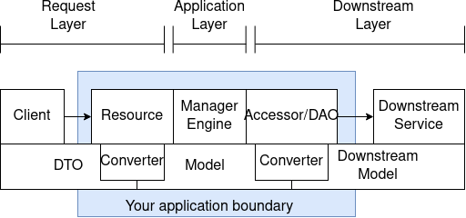

# Java

Notes about the Java code.

## Build

Requires

* JDK17
* Gradle (Tested with 8.0)
* Docker for endToEnd tests

```shell
gradle clean build test
```

Integration tests take additional time. To execute build with full integration
tests, do this:

```shell
gradle build test -Pinteg
```

and, of course, if you just want to run the integ tests...

```shell
gradle test -Pinteg
```

### End to end tests

The end to end suite starts up the control and data plane, with needed
subsystems. This will abuse your memory and take a while.

To run the end to end tests, you can simply do

```shell
gradle test -Pe2e
```

or

```shell
gradle clean build test -Pinteg -Pe2e
```

This will enable the endToEnd subproject. Else that project is skipped.

Note, when trying to run e2e tests in the intelij instance, you'll need to edit
the configuration since intelij will start ignoring tests labeled integ now. Do
this by adding `-Pe2e` to the params.

Logs for the services in these runs are in `build/docker-logs`.

When end to end tests fail, the `docker compose down` command will not execute
from the endToEnd directory. If you start having problems, issue that command
manually from that directory. (May end up moving the docker start/stop into the
test suite)

### Troubleshooting

#### Dependencies

The dependencies for this project are controlled by the dependencies
artifact. (`com.codeheadsystesms:dependencies`). The SNAPSHOT build is used so
it is easy to update dependencies here. For whatever reason, if the dependencies
in the public nexus service is out of date, you can clone
`github.com:wolpert/dependencies` and run `gradle publishToMavenLocal`.

#### Docker volume mess-up

Sometimes doing a clean isn't enough, especially if you change the name of the
project. Docker volumes may need to be removed. Example

`docker volume rm endtoend_logs`

#### :node:run

If you run into problems when trying to run :node:run, remove

* /tmp/dataNodeConfig.json: This is the configuration file with local keys.
* /tmp/nodeInternalDb: this is the directory with the node's database.

```shell
rm -rf /tmp/dataNodeConfig.json /tmp/nodeInternalDb
```

#### AES Failure

* If you deleted your configuration, the data is lost. Remember to replace all
  databases.
* Shows up as grabbing the connection just hangs.

#### Gradle version

There have been issues with plugins like checkstyle if the gradle version is
mismatched. Officially the version in the gradle-wrapper.properties is the
version we should build with. 8.0.2 as of last checked.

## Package layout.

Layout is based on the Managed Model format updated for Dropwizard/Dagger
friendliness. Flat hierarchy.

[](https://viewer.diagrams.net/?tags=%7B%7D&highlight=0000ff&edit=_blank&layers=1&nav=1&title=Manager%20Model.drawio#R5VrbcpswEP0aP7YDyPjy6FuT6aTTTtyZNn1TYA1qZOTKcmz36yuMwCAR23Fi8NA8ZKSVWKFzVrurxS00mm9uOF6EX5gPtOVY%2FqaFxi3H6Vo9%2BT8WbBNBx0KJIODET0T2XjAlf0EJLSVdER%2BWhYmCMSrIoij0WBSBJwoyzDlbF6fNGC2uusABGIKph6kp%2FUF8ESbSnmvt5bdAgjBd2bbUyBynk5VgGWKfrXMiNGmhEWdMJK35ZgQ0xi7FJXnu0wuj2YtxiMQpD%2FRm979%2FfKbO7cPwD4QY%2BUMPfVBanjFdqQ2rlxXbFAHOVpEPsRKrhYbrkAiYLrAXj64l5VIWijmVPVs2Z4TSEaOM755FPobezJPypeDsCXIjHa8HjzM5Ym4jfSfgAjY5kdrWDbA5CL6VU9So47jJI9uMhKS%2F3jOGLDUnzLPVUROxspIg070HUjYUluW4fn%2F6%2BvT08%2Bb27rM94cv27YdfU1yKa4fKZYc%2BeZbNIG5%2BwZE0H56OyIVygyXzJ1FAIkgHHrk%2BVVfwFiLfgRaErCItyKSlZ5msXIwUxyBFuauagZJesghU3wQqk%2BWRci9mvl0DFPClX1RdxkXIAhZhOtlLh0XY9nPuGFsosH6DEFvl5PFKsBOhXLIV9%2BDA%2B6qYIjAPQByYp3xAvJeDxHCgWJDnYgx4d5SRYY8Dz4PlUvpI59N48LV2w2zbx09wFvAqOcKuAdmYrSMZXQDPTcc4Bf5MJDx14%2Bi614Zj38DxHtQpqxssp30crDJneLlY7tbhDGFDxM9c%2ByFW9dFVvfFGad51tqpzvgNND%2FpRD9q%2FKg%2BavnbOjkeUxLuv24rtE6y4W6kVmynp%2BHv9IcbAqSz3cavMfTqvCjHXkUG2O9eWQbbNg8mi3YZ4%2FWg5x9Equ5i0L3Y2zUzwetBy9OSlBK0yT3YxtJwTihYQ%2BYO4%2BiN7EYvgRFCORrXclg%2F5pJODn1rhGyNxyHrJJ%2FY0JJNorh5ychUfTQ9yDutJgr2hZ0dKtuk38GTet5vFk17gOJcn%2FZpVNU%2Bm92kWT7q%2FP5enjlsvT2ZMbRZPut%2Frn8mTrkfPqS%2FNk1mkaBZPelw5lyddT9U8mZl%2B03jqf%2Bx034kqQ1XVbHUbzlbbiiG2sj%2F7XYg7rLVqDntN59C%2BCIcHtVbNoVk6bhaHepZ3Lmu6nop5QuYtebBYUOJJbFhkFrLu8Lak2CBgI4r0Fb%2FkK3rzn%2F2VCFMSRLLrSZqlYjSMKw5ydTpQA3Pi%2B7tSeVkJo1jkeNFkXvExWmMjTRFzNtUusSnHetl83vbtz7wc38OfFSzFf0eN3XevixrzPnyoAtxwdlxU28Ep%2FcWSeW4epEOOV8p7N%2BsxxgGr9RpJjKPV%2FLP4l2Mmo%2BGN1Mju%2FodqSYTa%2F9oPTf4B)

Packages are as follows;

* **api**: Classes used for communications with upstream clients that call the
  service.
* **component**: Dagger components for setup. (May be combined later into one
  Dagger package with module.)
* **converter**: Used to convert objects from upstream or downstream
  dependencies so managers/engines only needs to know about internal model
  objects.
* **dao/accessor**: Used to communicate with downstream dependencies. (May be
  unified into 'accessors' only)
* **engine**: Shared business logic. Engines can be used by many managers and/or
  resources.
* **factory**: Builders for individual object instances that need care and
  feeding.
* **healthchecks**: Dropwizard bucket for health checks.
* **manager**: Business logic internal to application. Managers should not call
  other managers, but can if it makes sense.
* **model**: Internal structure of data.
* **module**: Dagger modules used for IoC/Injection.
* **resources**: How upstream clients call into the dropwizard application. They
  do conversion of the data as needed and call the proper manager.

## Logging

* All constructors that are injected are logged at INFO.
* Any table creation commands are logged at INFO since those are fairly
  important.
* Customers actions are logged at debug.
* Every internal public method for the classes are logged at trace.
* Adding extra logs as needed, but when in doubt, consider metrics.

## Testing with curl (node)

```shell
curl -v -X PUT 'http://localhost:8080/v1/tenant/customer01'
curl -v -X PUT 'http://localhost:8080/v1/tenant/customer01/table/testtable?primaryKey=fred'
curl -v -X PUT  -H "Content-Type: application/json" \
    -d '{"name": "a test field", "something": 55443}' \
     'http://localhost:8080/v1/tenant/customer01/table/testtable/entry/0001'
curl -v 'http://localhost:8080/v1/tenant/customer01/table/testtable/entry/0001'
curl -v -X DELETE 'http://localhost:8080/v1/tenant/customer01/table/testtable/entry/0001'
curl -v -X DELETE 'http://localhost:8080/v1/tenant/customer01/table/testtable'
curl -v -X DELETE 'http://localhost:8080/v1/tenant/customer01'
```

## Modules

* common: Stuff that is shared with all code bases.
* common-javaClient: Java client utilities that are shared everywhere.
* config-common: Library to talk to the configuration service.
* control: The control plane service.
* control-common: API code shared from the control plane and its clients.
* control-javaClient: java client for the control plane clients.
* endToEnd: end to end tests. These will take the most time.
* node: The node service.
* node-common: API code shared from the node to its clients.
* node-javaClient: java client for the node clients.
* proxy: The proxy service
* server-common: Common files for all services. (May turn into its own project)
